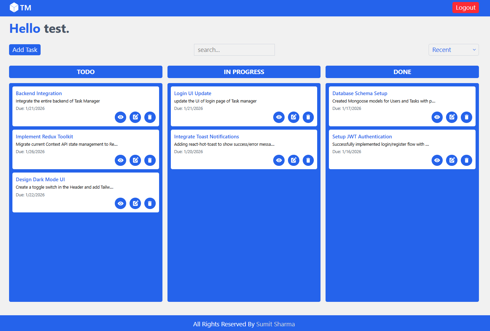
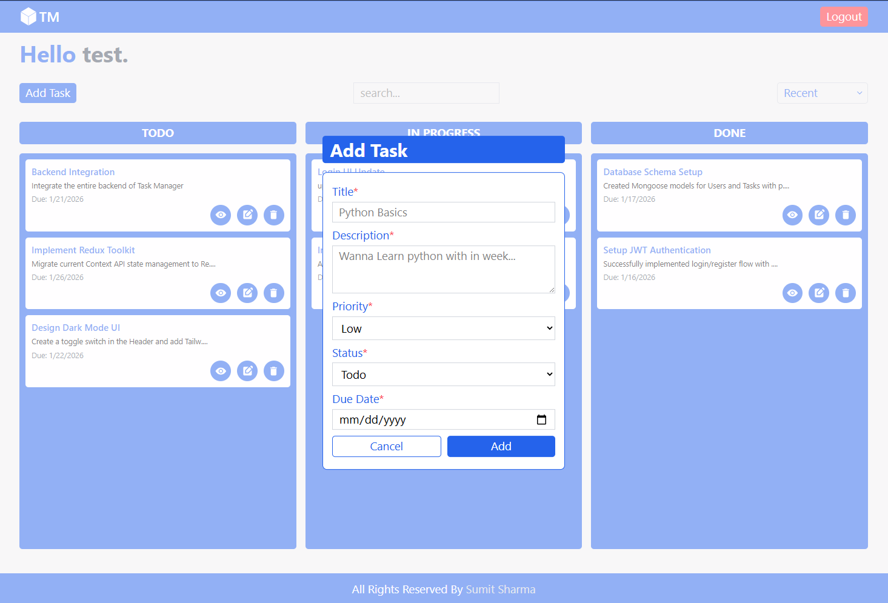
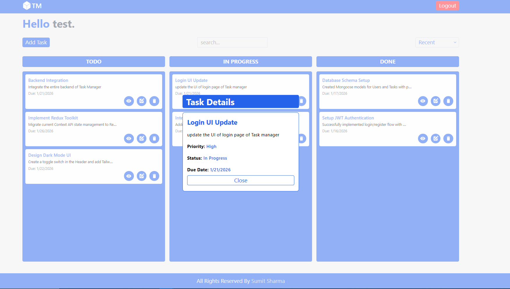
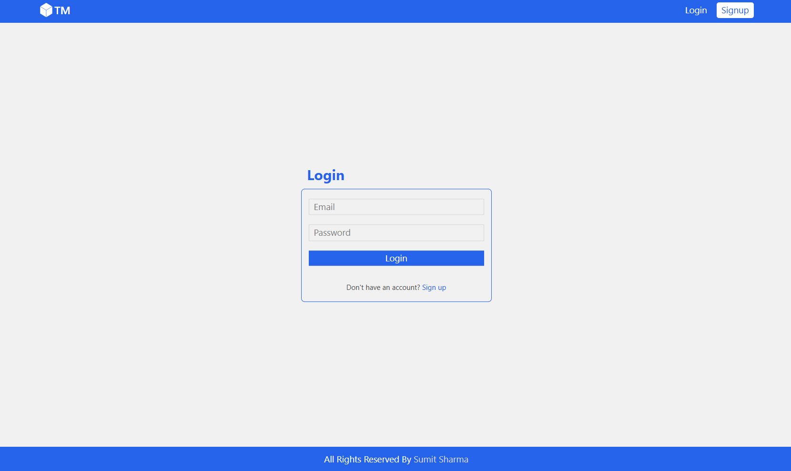
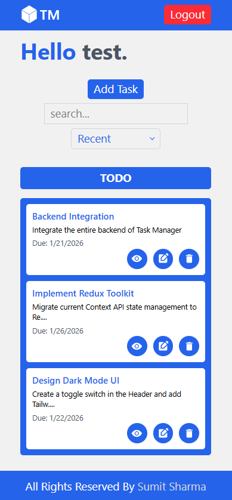

# 🚀 TM - Task Manager

A full-stack, responsive **Task Management Application** built with the **MERN Stack** (MongoDB, Express, React, Node.js) and styled using **Tailwind CSS**.

This application helps users efficiently manage their daily tasks using a **Kanban-style board** with statuses like **Todo, In Progress, and Done**.

    

## 🌐 Live Demo & Repository

🔗 **Live Demo:** [TM DEMO LINK](https://tm-manager-silk.vercel.app/)

🔗 **GitHub Repository:** [https://github.com/Sumit444-commits/TM-Task-Manager](https://github.com/Sumit444-commits/TM-Task-Manager)

> ### 🔑 Test Credentials
>
> If you'd like to explore the app without registering, feel free to use the following test account:
>
> - **Email:** `test@gmail.com`
> - **Password:** `test@123`

---

### 🏠 Dashboard



### ➕ Add Task



### 🏠 Task Detail



### 🔐 Login Page



### 📱 Mobile View



---

## ✨ Features

- ✅ **User Authentication** – Secure Login & Registration using JWT and bcrypt
- 📋 **Task CRUD** – Create, Read, Update, Delete tasks
- 📊 **Kanban Board Layout** – Todo, In Progress, Done
- 🎯 **Task Details** – Priority, Due Date, Description
- 🔍 **Search & Filter** – Find tasks easily
- 📱 **Fully Responsive** – Works on mobile, tablet & desktop
- ⚡ **State Management** – React Context API

---

## 🛠️ Tech Stack

### **Frontend**

- React.js (Vite)
- Tailwind CSS
- React Router DOM
- Context API

### **Backend**

- Node.js & Express.js
- MongoDB & Mongoose
- JSON Web Tokens (JWT)
- bcrypt.js

---

## 📂 Project Structure

### Backend

backend/

├── controllers/

├── middleware/

├── models/

├── routes/

├── utils/

└── server.js

### Frontend

frontend/

├── src/

│ ├── components/

│ ├── context/

│ ├── pages/

│ ├── App.jsx

│ └── main.jsx

---

## 🚀 Getting Started

### Prerequisites

- Node.js installed
- MongoDB Atlas or local MongoDB

### Installation

#### 1️⃣ Clone the repository

```md
git clone https://github.com/Sumit444-commits/TM-Task-Manager
cd TM-Task-Manager

2️⃣ Setup Backend
cd backend
npm install


Create a .env file in backend/ and add:

PORT=5000
MONGODB_URI=your_mongodb_connection_string
JWT_SECRET=your_secret_key


Start the server:

npm start

3️⃣ Setup Frontend
cd ../frontend
npm install


Create a .env file in frontend/ and add:
VITE_API=your_server_url (e.g: "http://localhost:5000")

npm run dev
```

---

# 👨‍💻  Author

## Sumit Sharma

🔗 **GitHub:** [Sumit444-commits](https://github.com/Sumit444-commits)

🔗 **LinkedIn:** [Sumit Sharma](https://www.linkedin.com/in/sumit-sharma-a0b2c7)

🔗 **Portfolio:** [https://www.sumitsharma.codes/](https://www.sumitsharma.codes/)
